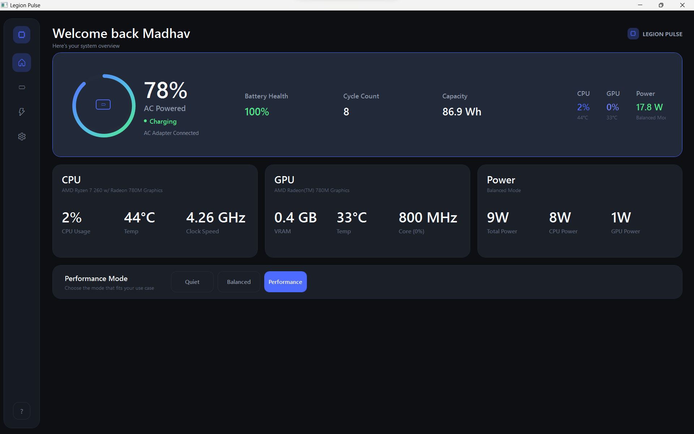
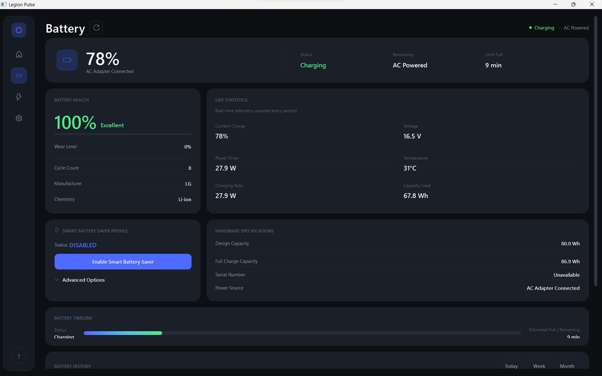
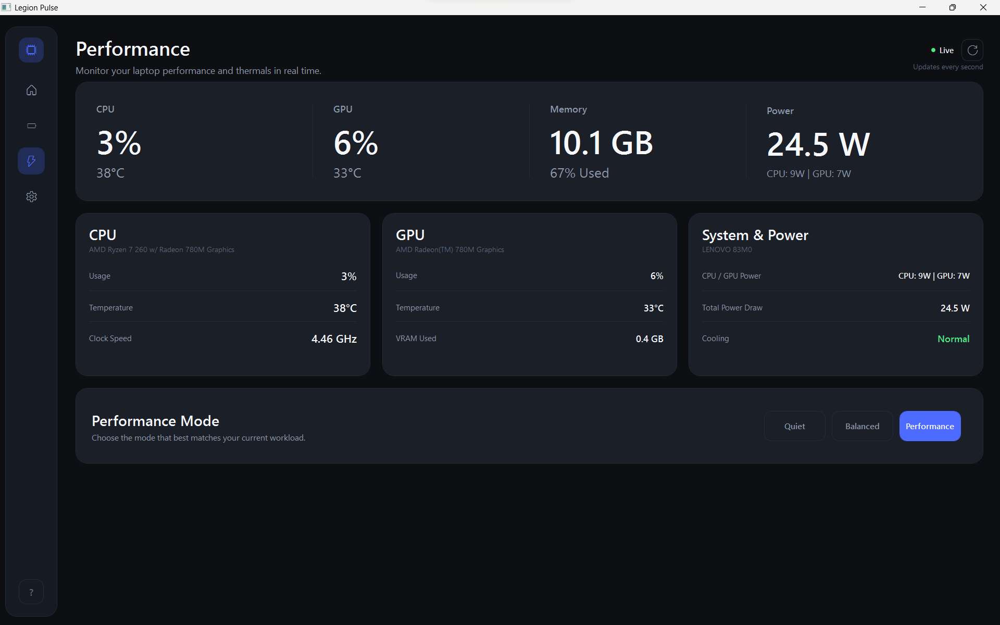
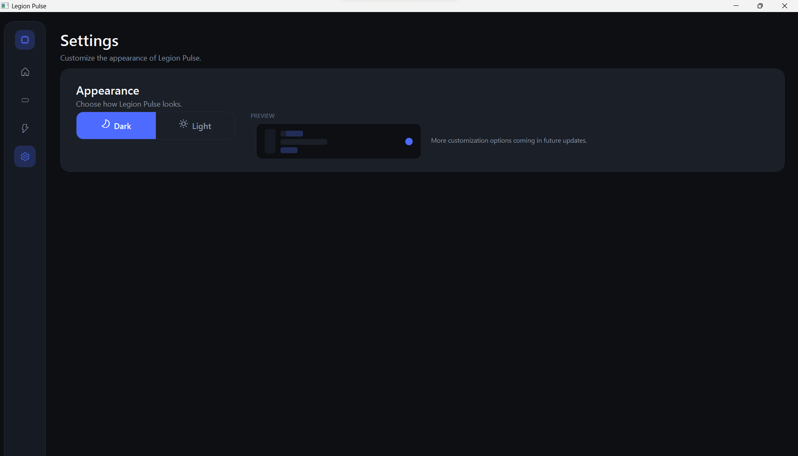

# Legion Pulse

Legion Pulse is a modern .NET 8 WPF desktop companion application built for Lenovo Legion laptops. It provides real-time hardware telemetry, battery health metrics, power mode toggles, and system controls in a sleek dark interface.



## Features

- **Hardware Telemetry**: Real-time CPU & GPU power consumption, temperatures, utilization, and fan metrics.
- **Battery Health & Statistics**: Tracks charge percentage, estimated battery runtime, battery wear, cycle count, and dynamic discharge rates.
- **Power Mode Controls**: Seamless Fn+Q thermal mode toggles (Performance, Balance, Quiet) and battery conservation mode integration.
- **System Information**: Overview of system specifications, GPU details, and memory utilization.

## Application Preview

| Dashboard | Battery |
|---|---|
|  |  |

| Performance | Settings |
|---|---|
|  |  |

## Repository Structure

```text
LegionPulse/
├── Controls/           # Reusable UI navigation controls
├── Models/             # Hardware & telemetry data models
├── Resources/          # Colors, typography, control styles, and app icons
├── Services/           # Telemetry monitoring, WMI system control, and navigation
├── ViewModels/         # MVVM Page ViewModels (CommunityToolkit.Mvvm)
├── Views/              # WPF Views (Dashboard, Battery, Performance, Settings)
├── Screenshots/        # Application UI previews
├── LegionPulse.csproj  # C# project configuration
└── LegionPulse.slnx    # Solution file
```

## Getting Started

### Prerequisites
- Windows 10 / 11 (64-bit)
- .NET 8 SDK
- Administrator privileges (required for Ring-0 hardware sensor access via `LibreHardwareMonitor`)

### Building & Running

1. Clone the repository:
   ```bash
   git clone https://github.com/Madhav4362/Legion-Pulse.git
   cd Legion-Pulse
   ```

2. Restore dependencies and run:
   ```powershell
   dotnet restore
   dotnet run
   ```

3. To build a standalone Release executable:
   ```powershell
   dotnet build -c Release
   ```

## License

MIT License
